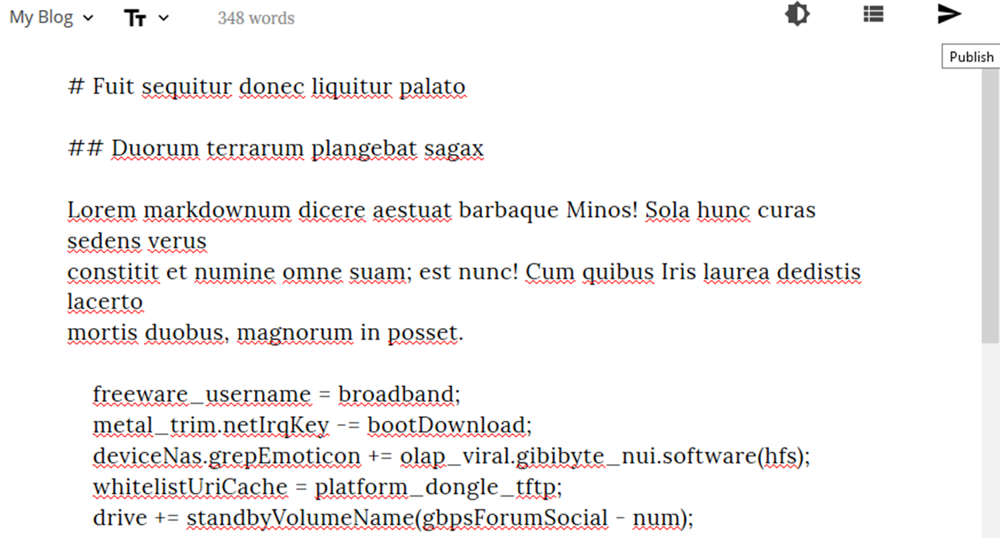

<!--
N.B.: This README was automatically generated by https://github.com/YunoHost/apps/tree/master/tools/README-generator
It shall NOT be edited by hand.
-->

# WriteFreely for YunoHost

[](https://dash.yunohost.org/appci/app/writefreely)    
[](https://install-app.yunohost.org/?app=writefreely)

*[Lire ce readme en français.](./README_fr.md)*

> *This package allows you to install WriteFreely quickly and simply on a YunoHost server.
If you don't have YunoHost, please consult [the guide](https://yunohost.org/#/install) to learn how to install it.*

## Overview

For starting a minimalist, federated blog or an entire community.

**Shipped version:** 0.13.1~ynh1

**Demo:** https://write.as/new

## Screenshots




## Disclaimers / important information

* Any known limitations, constrains or stuff not working, such as (but not limited to):
    * **WriteFreely** require a dedicated **root domain**, eg. writefreely.domain.tld
    * i386 architectures not supported
    * No LDAP and no HTTP auth supported

* Other infos that people should be aware of, such as:
    * If User Mode is configured Multiple users, the app be used by multiple users
    * Additionals parameters can be configured in Settings / Admin settings.

## Documentation and resources

* Official app website: https://writefreely.org
* Official user documentation: https://writefreely.org/start
* Upstream app code repository: https://github.com/writeas/writefreely
* YunoHost documentation for this app: https://yunohost.org/app_writefreely
* Report a bug: https://github.com/YunoHost-Apps/writefreely_ynh/issues

## Developer info

Please send your pull request to the [testing branch](https://github.com/YunoHost-Apps/writefreely_ynh/tree/testing).

To try the testing branch, please proceed like that.
```
sudo yunohost app install https://github.com/YunoHost-Apps/writefreely_ynh/tree/testing --debug
or
sudo yunohost app upgrade writefreely -u https://github.com/YunoHost-Apps/writefreely_ynh/tree/testing --debug
```

**More info regarding app packaging:** https://yunohost.org/packaging_apps